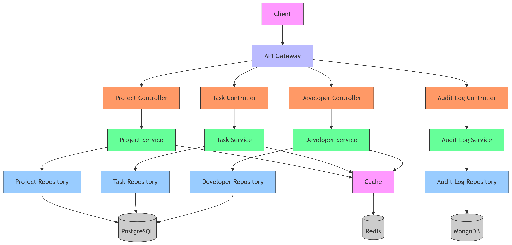
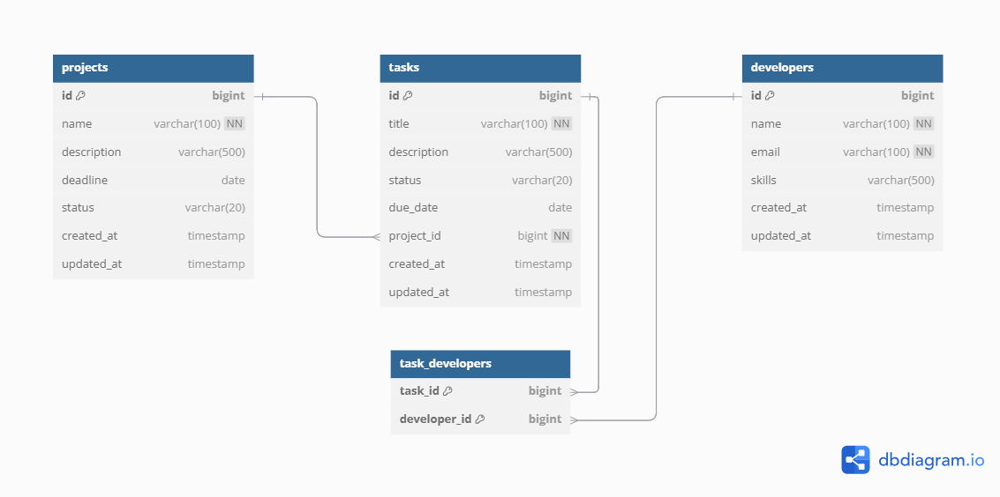

# Project Tracker Application

A Spring Boot application for tracking projects, tasks, and developers with JPA (PostgreSQL) and audit logging in MongoDB.

## Features

- CRUD operations for Projects, Tasks, and Developers
- Pagination and sorting for all entities
- Transaction management for data consistency
- Caching for improved performance
- Audit logging to MongoDB for all changes
- Advanced queries 
- Swagger UI for API documentation

## Technologies

- Java 21
- Spring Boot 3.x
- Spring Data JPA (PostgreSQL)
- Spring Data MongoDB
- Redis for caching

## Diagrams

Below are the system diagrams used for understanding the architecture and data model:

### System Architecture Diagram



### Entity Relationship (ER) Diagram



## Setup

### Prerequisites

- Java 21
- Maven
- Docker

### Docker

Build and start all services:

```bash
docker-compose up --build
```

## Access the application

- API: [http://localhost:8080/api/v1/projects](http://localhost:8080/api/v1/projects)
- Swagger UI: [http://localhost:8080/swagger-ui.html](http://localhost:8080/swagger-ui.html)

## Sample API Endpoints

### Projects

- `GET /api/v1/projects` - Get paginated list of projects
- `GET /api/v1/projects/{id}` - Get project by ID
- `POST /api/v1/projects` - Create new project
- `PUT /api/v1/projects/{id}` - Update project
- `DELETE /api/v1/projects/{id}` - Delete project
- `GET /api/v1/projects/without-tasks` - Get projects without tasks
- `GET /api/v1/tasks/overdue` - Get overdue tasks
- `GET /api/v1/developers/top` - Get top 5 developers by task count
- `GET /api/v1/logs?entityType={type}` - Filter logs by entity type
- `GET /api/v1/logs?actorName={name}` - Filter logs by actor name
