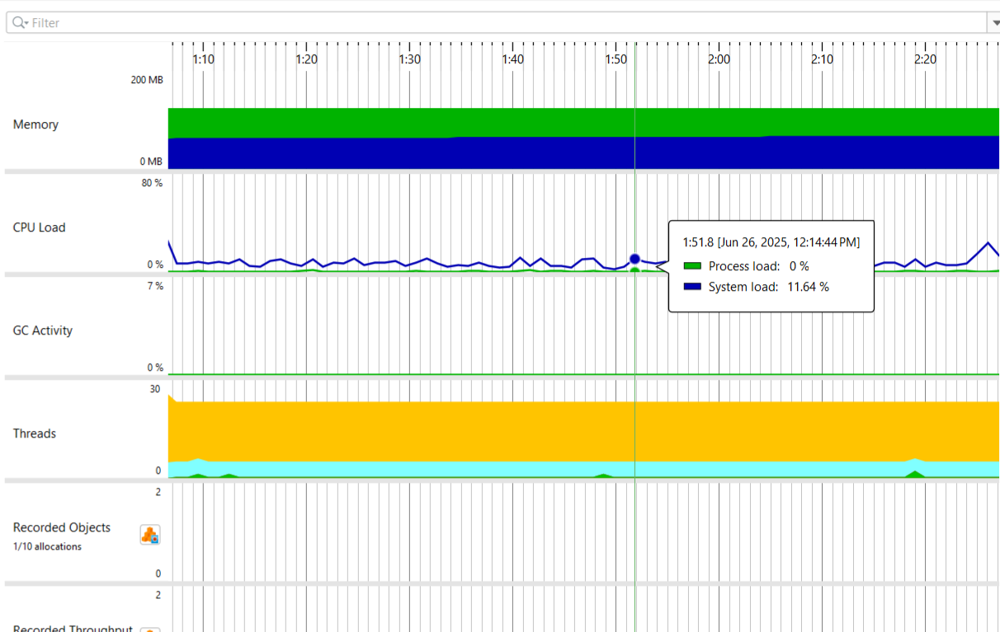
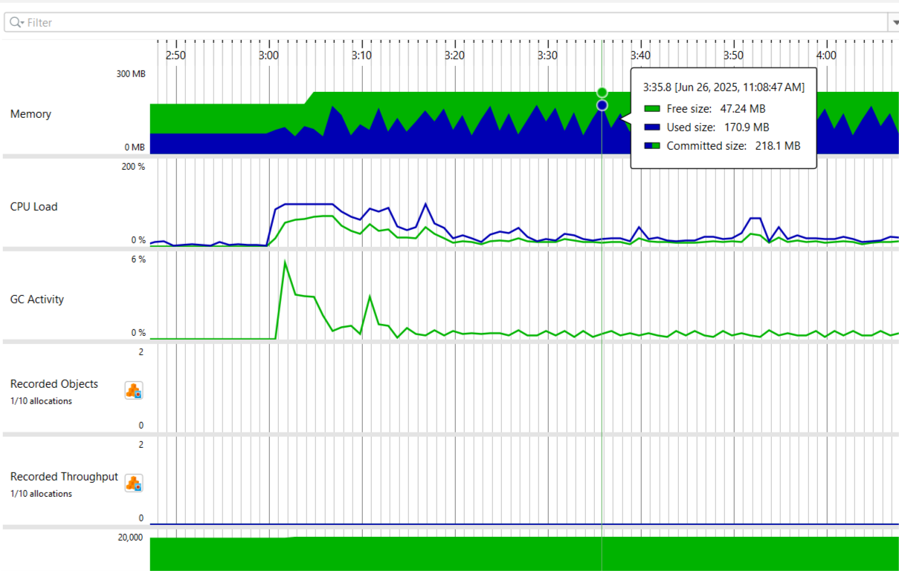
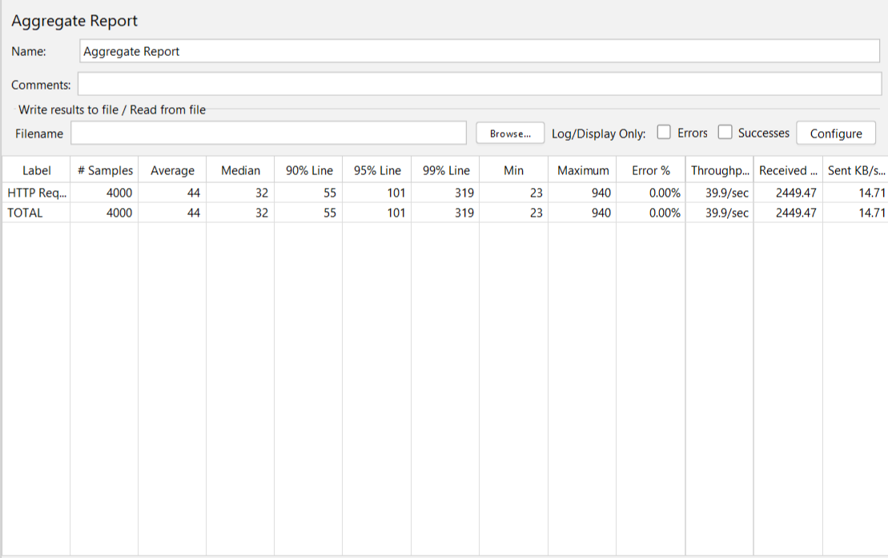
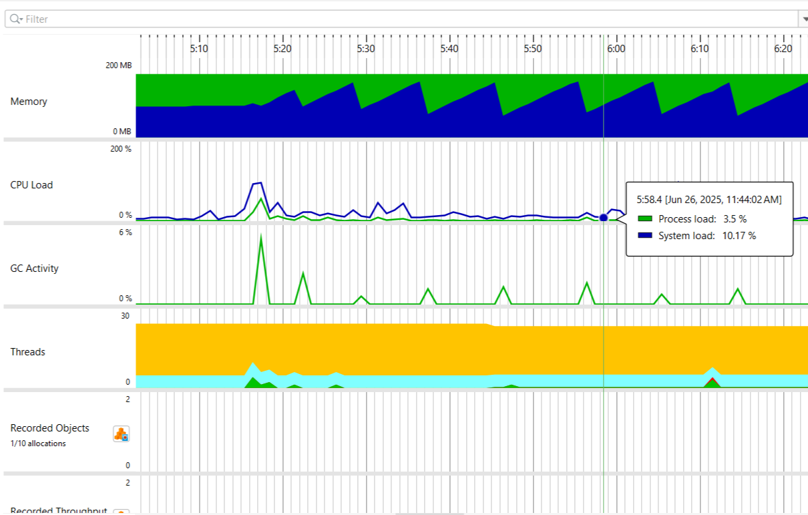
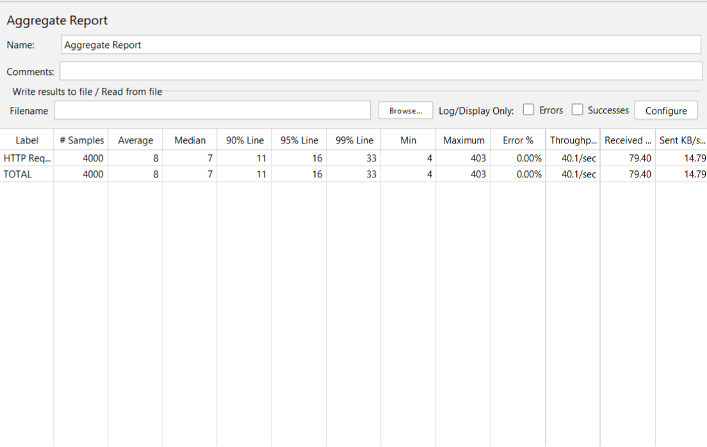
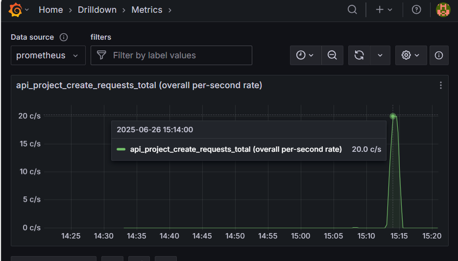

# 🧪 Performance Profiling & Optimization Report

## 📋 Initial Profiling Summary

Click to expand

### Tools Used
- [ ] JProfiler
- [ ] JMeter
- [ ] Prometheus
- [ ] Grafana

### Screenshot

---

## 🚨 Performance Issues Discovered

* **Large response payloads** resulting in high latency and bandwidth usage.

* **Repeated queries** for frequently requested data causing unnecessary load.

* **Inefficient data transfer** due to overfetching entity fields.

---

## ⚙️ Optimization Actions and Their Impact

* **Pagination** to limit data volume per request.

* **Use of DTOs** to include only necessary fields.

* **Caching** of frequently accessed resources.

---

## 📊 Before vs. After Benchmarks (Load Test 4000 Sample Requests)

### Average Response Time (ms)
- Before: `44ms`
- After: `8ms`

### Received (KB/sec)
- Before: `2449.47`
- After: `79.40`

### Benchmark Visualization
#### Before

#### After

---

## 📝 Summary

Performance improved significantly after optimization:
- ✅ Reduced response time by ~81.8%
- ✅ Reduced received data per second by ~96.76%

---

## 📈 Prometheus & Grafana Monitoring

This project includes monitoring of API usage using Prometheus and Grafana.

### 🔧 Custom Metric: Create Project Requests

It tracks the total number of **create project API calls** with a custom counter:

**Metric Name:** `api_project_create_requests_total`

### Sample Results

- ✅ During a JMeter test with 2,000 requests, a peak of 20 requests/second was observed.

- ✅ After the test, request rate returned to baseline (0 c/s).

